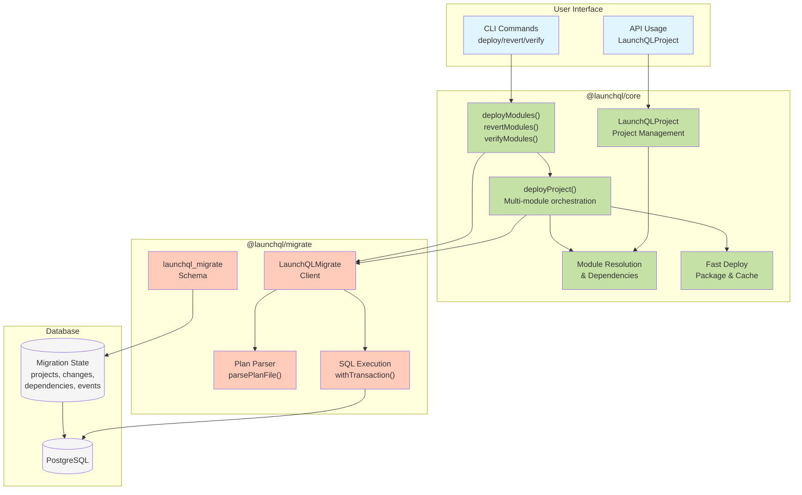
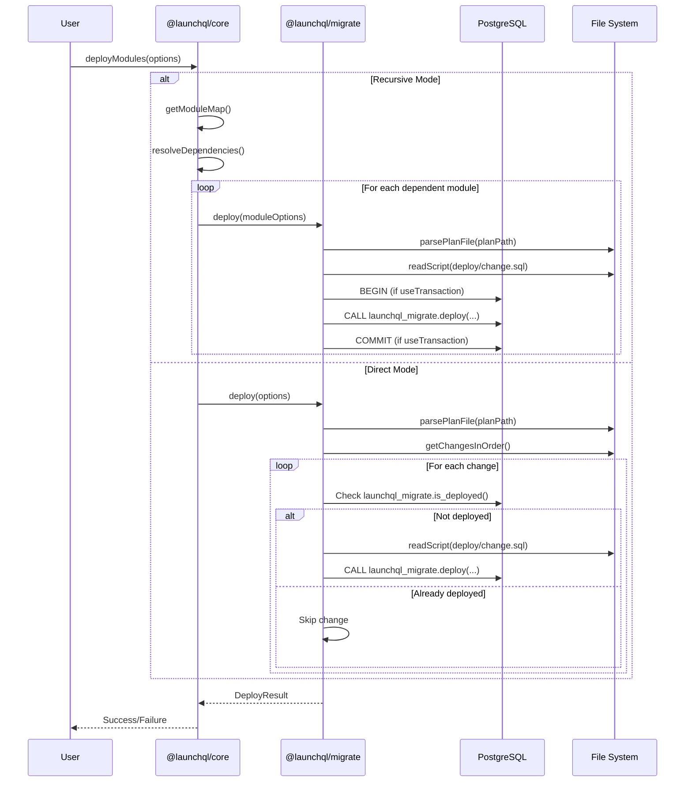

# LaunchQL Migration System Documentation

## Architecture Overview

LaunchQL provides a modern, TypeScript-based database migration system that serves as a drop-in replacement for Sqitch. The system is split into two main packages:

- **@launchql/core**: High-level orchestration layer that manages multi-module projects, dependencies, and deployment strategies
- **@launchql/migrate**: Low-level migration engine that handles the actual database operations

## System Flow

