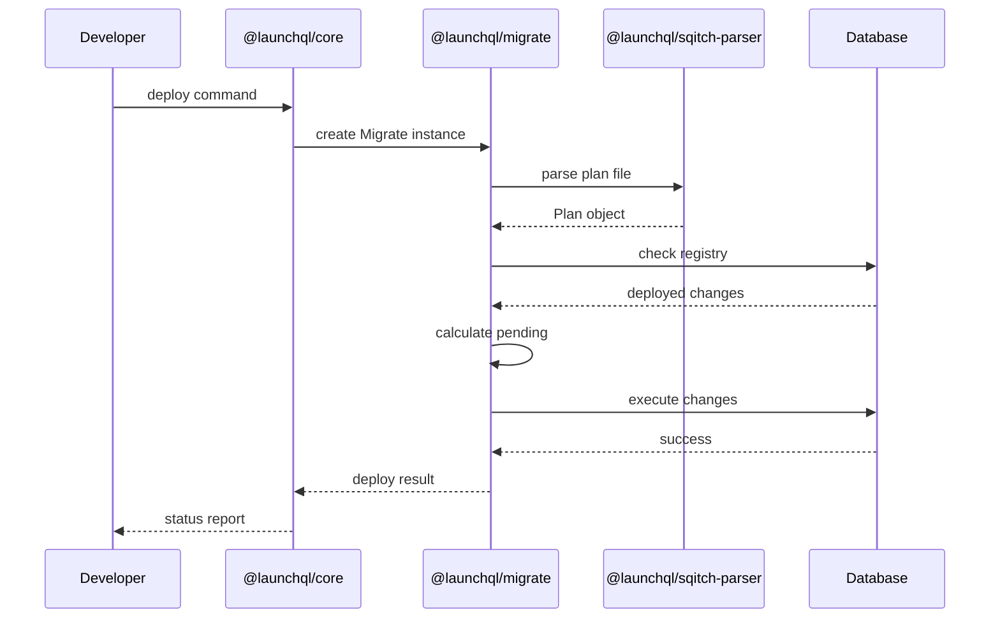
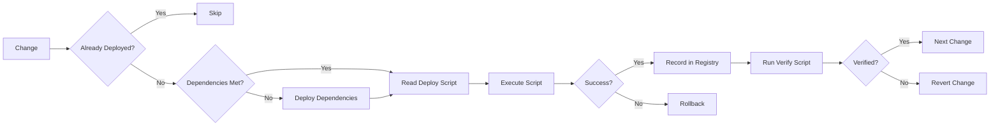

# LaunchQL Migrate Documentation

## Overview

LaunchQL provides a comprehensive PostgreSQL migration system built on top of Sqitch, consisting of two main packages:

- **@launchql/migrate**: Low-level migration engine (pure Sqitch replacement for PostgreSQL)
- **@launchql/core**: High-level orchestration and project management for PostgreSQL databases

## Architecture Flow

```mermaid
graph TD
    A[Developer] -->|Commands| B[LaunchQL CLI]
    B --> C[@launchql/core]
    C --> D[@launchql/migrate]
    D --> E[@launchql/sqitch-parser]
    D --> F[PostgreSQL Database]
    
    C -->|Project Management| G[Project Config]
    C -->|Extension Management| H[PG Extensions]
    C -->|Schema Management| I[PG Schemas]
    
    D -->|Plan Execution| J[Sqitch Plan]
    D -->|Change Tracking| K[Migration Registry]
    
    E -->|Parse| L[.plan files]
    E -->|Parse| M[.conf files]
    
    style C fill:#f9f,stroke:#333,stroke-width:4px
    style D fill:#bbf,stroke:#333,stroke-width:4px
```

## Package Responsibilities

### @launchql/migrate (Low-Level Engine)

The migrate package is a pure TypeScript implementation of Sqitch's core functionality for PostgreSQL:

- **Plan Execution**: Reads and executes Sqitch plan files
- **Change Management**: Tracks deployed changes in the PostgreSQL database
- **Verification**: Runs verification scripts after deployments
- **Reversion**: Handles rollback of changes
- **PostgreSQL Integration**: Optimized specifically for PostgreSQL features

### @launchql/core (High-Level Orchestration)

The core package provides project-level management and orchestration:

- **Project Structure**: Manages multi-schema, multi-extension projects
- **Configuration**: Handles complex project configurations
- **Extension System**: Manages PostgreSQL extensions
- **Schema Management**: Orchestrates schema creation and dependencies
- **Template System**: Provides project scaffolding

## API Documentation

### @launchql/migrate API

#### Main Classes

##### `Migrate`
The main class for executing migrations.

```typescript
class Migrate {
  constructor(options: MigrateOptions)
  
  // Core methods
  deploy(options?: DeployOptions): Promise<DeployResult>
  revert(options?: RevertOptions): Promise<RevertResult>
  verify(options?: VerifyOptions): Promise<VerifyResult>
  status(): Promise<StatusResult>
  
  // Plan management
  getPlan(): Plan
  getDeployedChanges(): Promise<Change[]>
  
  // Database connection
  connect(): Promise<void>
  disconnect(): Promise<void>
}
```

##### `MigrateOptions`
```typescript
interface MigrateOptions {
  // Database configuration
  host?: string
  port?: number
  database?: string
  username?: string
  password?: string
  
  // Project paths
  planFile: string
  deployDir?: string
  revertDir?: string
  verifyDir?: string
  
  // Registry configuration
  registry?: string
  
  // Logging
  logger?: Logger
}
```

##### `Plan`
Represents a parsed Sqitch plan.

```typescript
interface Plan {
  project: string
  uri?: string
  changes: Change[]
  tags: Tag[]
  
  // Methods
  getChange(name: string): Change | undefined
  getTag(name: string): Tag | undefined
  getChangesAfter(change: string): Change[]
  getChangesBefore(change: string): Change[]
}
```

##### `Change`
Represents a single change in the plan.

```typescript
interface Change {
  name: string
  dependencies: string[]
  timestamp?: string
  planner?: string
  email?: string
  comment?: string
  
  // File paths
  deployFile?: string
  revertFile?: string
  verifyFile?: string
}
```

#### Usage Examples

##### Basic Deployment
```typescript
import { Migrate } from '@launchql/migrate';

const migrate = new Migrate({
  host: 'localhost',
  port: 5432,
  database: 'mydb',
  username: 'user',
  password: 'pass',
  planFile: './sqitch.plan',
  deployDir: './deploy',
  revertDir: './revert',
  verifyDir: './verify'
});

// Deploy all changes
await migrate.deploy();

// Deploy to a specific change
await migrate.deploy({ to: 'add_users_table' });

// Deploy with tag
await migrate.deploy({ to: '@v1.0.0' });
```

##### Reversion
```typescript
// Revert last change
await migrate.revert({ count: 1 });

// Revert to specific change
await migrate.revert({ to: 'create_schema' });

// Revert all changes
await migrate.revert({ to: 'ROOT' });
```

##### Status Check
```typescript
const status = await migrate.status();

console.log('Project:', status.project);
console.log('Deployed changes:', status.deployedChanges.length);
console.log('Pending changes:', status.pendingChanges.length);

status.deployedChanges.forEach(change => {
  console.log(`- ${change.name} (${change.deployedAt})`);
});
```

### @launchql/core API

#### Main Classes

##### `LaunchQL`
The main orchestration class.

```typescript
class LaunchQL {
  constructor(config: LaunchQLConfig)
  
  // Project management
  init(options?: InitOptions): Promise<void>
  scaffold(template: string): Promise<void>
  
  // Deployment
  deploy(options?: DeployOptions): Promise<void>
  revert(options?: RevertOptions): Promise<void>
  verify(): Promise<void>
  
  // Extension management
  installExtension(name: string): Promise<void>
  removeExtension(name: string): Promise<void>
  listExtensions(): Promise<Extension[]>
  
  // Schema management
  createSchema(name: string): Promise<void>
  dropSchema(name: string): Promise<void>
  listSchemas(): Promise<Schema[]>
}
```

##### `LaunchQLConfig`
```typescript
interface LaunchQLConfig {
  // Project settings
  name: string
  version: string
  description?: string
  
  // Database configuration
  database: DatabaseConfig
  
  // Project structure
  schemas: SchemaConfig[]
  extensions: ExtensionConfig[]
  
  // Paths
  rootDir?: string
  deployDir?: string
  revertDir?: string
  verifyDir?: string
  
  // Options
  createDatabase?: boolean
  dropDatabase?: boolean
}
```

##### `SchemaConfig`
```typescript
interface SchemaConfig {
  name: string
  owner?: string
  dependencies?: string[]
  
  // Migration settings
  planFile?: string
  deployDir?: string
  revertDir?: string
  verifyDir?: string
}
```

##### `ExtensionConfig`
```typescript
interface ExtensionConfig {
  name: string
  version?: string
  schema?: string
  cascade?: boolean
}
```

#### Usage Examples

##### Project Initialization
```typescript
import { LaunchQL } from '@launchql/core';

const lql = new LaunchQL({
  name: 'my-project',
  version: '1.0.0',
  database: {
    host: 'localhost',
    database: 'myapp'
  },
  schemas: [
    { name: 'public' },
    { name: 'auth', owner: 'auth_user' },
    { name: 'api', dependencies: ['auth'] }
  ],
  extensions: [
    { name: 'uuid-ossp' },
    { name: 'pgcrypto', schema: 'auth' }
  ]
});

// Initialize project structure
await lql.init();

// Scaffold from template
await lql.scaffold('saas-starter');
```

##### Schema Management
```typescript
// Create new schema with migrations
await lql.createSchema('billing');

// Deploy specific schema
await lql.deploy({ schema: 'auth' });

// Deploy all schemas in dependency order
await lql.deploy();
```

##### Extension Management
```typescript
// Install extension
await lql.installExtension('postgis');

// List installed extensions
const extensions = await lql.listExtensions();
extensions.forEach(ext => {
  console.log(`${ext.name} v${ext.version} in schema ${ext.schema}`);
});
```

## Migration Flow

### 1. Plan Parsing


### 2. Change Deployment


### 3. Registry Structure

The migration registry tracks deployed changes in the database:

```sql
-- Registry schema (simplified)
CREATE SCHEMA sqitch;

CREATE TABLE sqitch.changes (
    change_id UUID PRIMARY KEY,
    change TEXT NOT NULL,
    project TEXT NOT NULL,
    deployed_at TIMESTAMPTZ NOT NULL,
    deployed_by TEXT NOT NULL,
    planned_at TIMESTAMPTZ,
    planner_name TEXT,
    planner_email TEXT,
    comment TEXT
);

CREATE TABLE sqitch.tags (
    tag_id UUID PRIMARY KEY,
    tag TEXT NOT NULL,
    change_id UUID REFERENCES sqitch.changes,
    applied_at TIMESTAMPTZ NOT NULL,
    applied_by TEXT NOT NULL,
    comment TEXT
);

CREATE TABLE sqitch.dependencies (
    change_id UUID REFERENCES sqitch.changes,
    dependency TEXT NOT NULL,
    PRIMARY KEY (change_id, dependency)
);
```

## Best Practices

### 1. Project Structure
```
my-project/
├── sqitch.conf           # Main configuration
├── sqitch.plan          # Main plan file
├── deploy/              # Deploy scripts
│   ├── schema.sql
│   ├── tables/
│   │   ├── users.sql
│   │   └── posts.sql
│   └── functions/
│       └── auth.sql
├── revert/              # Revert scripts
│   ├── schema.sql
│   ├── tables/
│   │   ├── users.sql
│   │   └── posts.sql
│   └── functions/
│       └── auth.sql
├── verify/              # Verification scripts
│   ├── schema.sql
│   ├── tables/
│   │   ├── users.sql
│   │   └── posts.sql
│   └── functions/
│       └── auth.sql
└── schemas/            # Multi-schema projects
    ├── auth/
    │   ├── sqitch.plan
    │   ├── deploy/
    │   ├── revert/
    │   └── verify/
    └── api/
        ├── sqitch.plan
        ├── deploy/
        ├── revert/
        └── verify/
```

### 2. Change Naming Conventions
- Use descriptive names: `create_users_table`, `add_email_index`
- Group related changes: `auth/create_roles`, `auth/create_permissions`
- Version major releases: `@v1.0.0`, `@v2.0.0`

### 3. Dependency Management
- Always declare dependencies explicitly
- Use tags for version boundaries
- Keep changes atomic and focused

### 4. Verification Scripts
- Verify structure, not data
- Keep verifications fast
- Test critical constraints

## Error Handling

Both packages provide detailed error information:

```typescript
try {
  await migrate.deploy();
} catch (error) {
  if (error instanceof DeploymentError) {
    console.error('Change:', error.change);
    console.error('Script:', error.script);
    console.error('Database error:', error.dbError);
  }
}
```

## Advanced Features

### 1. Custom Registry Schema
```typescript
const migrate = new Migrate({
  // ...
  registry: 'my_registry_schema'
});
```

### 2. Dry Run Mode
```typescript
await migrate.deploy({ 
  dryRun: true,
  verbose: true 
});
```

### 3. Parallel Schema Deployment
```typescript
await lql.deploy({ 
  parallel: true,
  maxConcurrency: 4 
});
```

### 4. Change Hooks
```typescript
migrate.on('beforeDeploy', (change) => {
  console.log(`Deploying ${change.name}...`);
});

migrate.on('afterDeploy', (change, result) => {
  console.log(`Deployed ${change.name} in ${result.duration}ms`);
});
```

## Migration from Sqitch

LaunchQL is designed to be compatible with existing Sqitch projects:

1. **Plan Files**: Fully compatible with Sqitch plan format
2. **Scripts**: Deploy/revert/verify scripts work without modification
3. **Registry**: Can read existing Sqitch registries
4. **Configuration**: Supports sqitch.conf format

To migrate:
```typescript
// Use existing Sqitch project
const migrate = new Migrate({
  host: process.env.DB_HOST || 'localhost',
  port: parseInt(process.env.DB_PORT || '5432'),
  database: process.env.DB_NAME,
  username: process.env.DB_USER,
  password: process.env.DB_PASSWORD,
  planFile: './sqitch.plan',
  // Points to existing Sqitch directories
  deployDir: './sql/deploy',
  revertDir: './sql/revert',
  verifyDir: './sql/verify'
});

// Works with existing registry
await migrate.status();
await migrate.deploy();
```

## Conclusion

LaunchQL provides a modern, TypeScript-native approach to database migrations while maintaining compatibility with the proven Sqitch format. The separation between the low-level migrate engine and high-level core orchestration allows for both simple migrations and complex multi-schema project management.