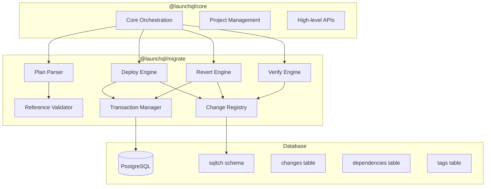
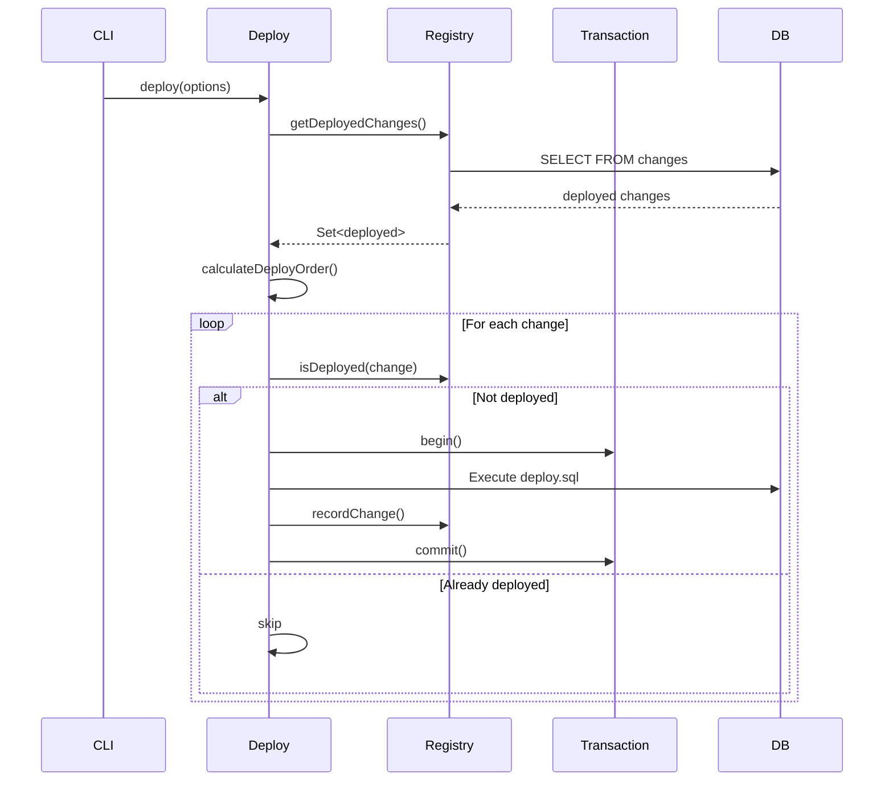
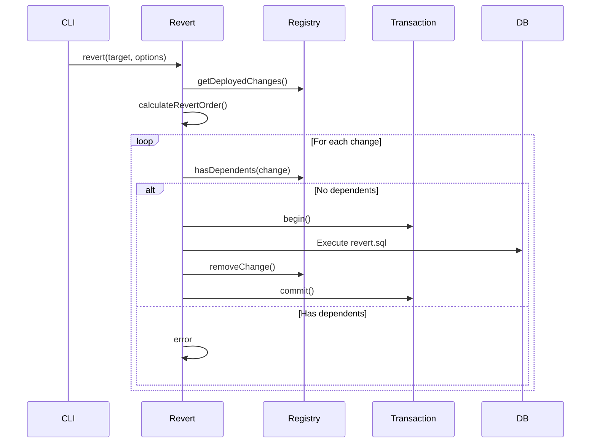

# LaunchQL Migrate Documentation

## Overview

LaunchQL Migrate (`@launchql/migrate`) is a low-level migration engine that serves as a pure TypeScript replacement for Sqitch. It provides database migration management with support for deployment, reversion, and verification of database changes.

## Architecture



## Core Components

### 1. Plan Parser (`src/parser/`)

The plan parser reads and validates Sqitch plan files, supporting all reference formats defined in the Sqitch specification.

#### Key Files:
- `plan-parser.ts` - Main parser with validation
- `validators.ts` - Reference validation logic
- `plan.ts` - Legacy parser (backwards compatibility)

#### Supported Reference Formats:

```typescript
// Plain change name
"users_table"

// Tag reference
"@v1.0"

// Change at specific tag
"users_table@v1.0"

// SHA1 reference (40 hex chars)
"abc1234567890123456789012345678901234567"

// Project-qualified forms
"other_project:users_table"
"other_project:@v1.0"
"other_project:abc1234567890123456789012345678901234567"

// Symbolic references
"HEAD"    // Last change
"ROOT"    // First change
"@HEAD"   // Alternative form
"@ROOT"   // Alternative form

// Relative references
"HEAD^"   // One change before HEAD
"HEAD^^"  // Two changes before HEAD
"HEAD^3"  // Three changes before HEAD
"@v1.0~"  // One change after tag v1.0
"@v1.0~2" // Two changes after tag v1.0
```

### 2. Deploy Engine (`src/commands/deploy.ts`)

Deploys database changes in dependency order.

#### Deploy Flow:



### 3. Revert Engine (`src/commands/revert.ts`)

Reverts deployed changes in reverse dependency order.

#### Revert Flow:



### 4. Verify Engine (`src/commands/verify.ts`)

Verifies that deployed changes match their expected state.

### 5. Change Registry (`src/registry/`)

Manages the sqitch schema and tracks deployed changes, dependencies, and tags.

## API Reference

### Plan Parser API

```typescript
import { parsePlanFileWithValidation } from '@launchql/migrate';

// Parse a plan file with full validation
const result = parsePlanFileWithValidation('/path/to/sqitch.plan');

if (result.errors.length > 0) {
  // Handle validation errors
  result.errors.forEach(error => {
    console.error(`Line ${error.line}: ${error.message}`);
  });
} else {
  // Use the parsed plan
  const plan = result.plan;
  console.log(`Project: ${plan.project}`);
  console.log(`Changes: ${plan.changes.length}`);
  console.log(`Tags: ${plan.tags.length}`);
}
```

### Reference Validation API

```typescript
import { isValidChangeName, isValidTagName, parseReference } from '@launchql/migrate';

// Validate change names
isValidChangeName('users_table');  // true
isValidChangeName('@invalid');     // false

// Validate tag names
isValidTagName('v1.0');           // true
isValidTagName('tag/with/slash'); // false

// Parse references
const ref = parseReference('other_project:users_table@v1.0');
// Returns: {
//   project: 'other_project',
//   change: 'users_table',
//   tag: 'v1.0'
// }
```

### Deploy API

```typescript
import { deploy } from '@launchql/migrate';

// Deploy all changes
await deploy({
  planFile: '/path/to/sqitch.plan',
  connection: pgConnection,
  transaction: true,  // Use transaction mode
  verify: true       // Verify after deploy
});

// Deploy to a specific target
await deploy({
  planFile: '/path/to/sqitch.plan',
  connection: pgConnection,
  target: '@v1.0'    // Deploy up to tag v1.0
});
```

### Revert API

```typescript
import { revert } from '@launchql/migrate';

// Revert to a specific change
await revert({
  planFile: '/path/to/sqitch.plan',
  connection: pgConnection,
  target: 'users_table',
  transaction: true
});

// Revert last 3 changes
await revert({
  planFile: '/path/to/sqitch.plan',
  connection: pgConnection,
  target: 'HEAD^3'
});
```

### Registry API

```typescript
import { Registry } from '@launchql/migrate';

const registry = new Registry(pgConnection);

// Check if a change is deployed
const isDeployed = await registry.isChangeDeployed('project', 'change_name');

// Get all deployed changes
const deployed = await registry.getDeployedChanges('project');

// Record a new deployment
await registry.recordChange({
  project: 'my_project',
  change: 'users_table',
  dependencies: ['initial_schema'],
  deployedBy: 'developer',
  deployedAt: new Date()
});
```

## Transaction Management

All operations support both transactional and non-transactional modes:

```typescript
// With transaction (default) - rolls back on error
await deploy({ 
  transaction: true,
  // ... other options
});

// Without transaction - continues on error
await deploy({ 
  transaction: false,
  // ... other options
});
```

## Cross-Project Dependencies

LaunchQL Migrate supports dependencies across different projects:

```typescript
// In project A's plan file
users_table 2024-01-01T00:00:00Z dev <dev@example.com>

// In project B's plan file
user_profiles [project_a:users_table] 2024-01-02T00:00:00Z dev <dev@example.com>
```

The system ensures that cross-project dependencies are satisfied before deployment and prevents reversion of changes that have cross-project dependents.

## Error Handling

All operations return detailed error information:

```typescript
try {
  await deploy(options);
} catch (error) {
  if (error.code === 'DEPENDENCY_NOT_MET') {
    console.error(`Missing dependency: ${error.dependency}`);
  } else if (error.code === 'VERIFICATION_FAILED') {
    console.error(`Verification failed for: ${error.change}`);
  }
}
```

## Best Practices

1. **Always use transactions in production** - This ensures database consistency
2. **Verify after deployment** - Use the `verify` option to ensure changes were applied correctly
3. **Use meaningful change names** - Follow the naming conventions (alphanumeric, underscore, hyphen)
4. **Tag releases** - Use tags to mark stable points in your migration history
5. **Test migrations** - Always test in a development environment first

## Migration from Sqitch

LaunchQL Migrate is designed to be compatible with existing Sqitch plan files and database schemas. To migrate:

1. Install `@launchql/migrate`
2. Point it to your existing `sqitch.plan` file
3. Use the same database connection
4. All existing deployments will be recognized

The main differences from Sqitch:
- Pure TypeScript implementation (no Perl required)
- Better error messages and validation
- Programmatic API for integration
- Support for modern JavaScript/TypeScript tooling