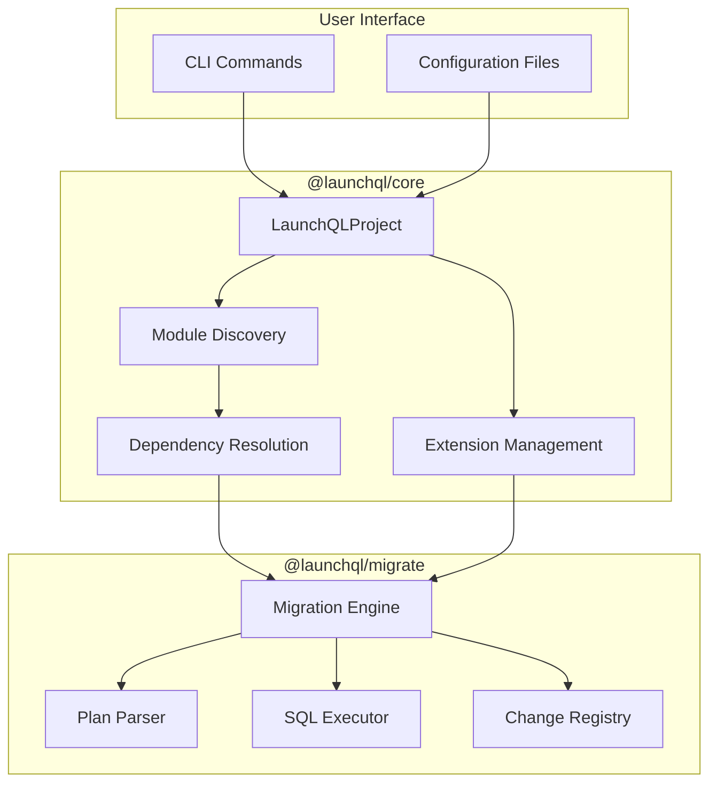
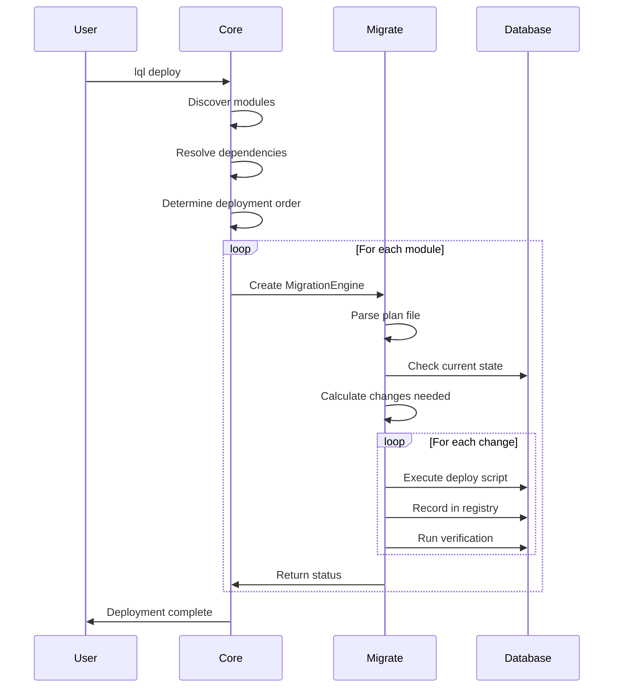

# LaunchQL Core vs Migrate Architecture Documentation

## Overview

LaunchQL's database migration system is built on two complementary packages that work together to provide a complete migration management solution:

- **@launchql/migrate**: Low-level migration engine (pure Sqitch replacement)
- **@launchql/core**: High-level orchestration and project management

## Architecture Flow



## Package Responsibilities

### @launchql/migrate (Low-Level Engine)

The migrate package is a pure TypeScript replacement for Sqitch, handling the core migration mechanics:

#### Core Components

1. **Migration Engine** (`src/engine/`)
   - Executes migrations in the correct order
   - Handles rollbacks and reverts
   - Manages transaction boundaries
   - Tracks migration state

2. **Plan Parser** (`src/parser/`)
   - Parses plan files (sqitch.plan/launchql.plan)
   - Validates change dependencies
   - Resolves symbolic references (HEAD, ROOT, tags)

3. **Change Registry** (`src/registry/`)
   - Tracks applied changes in the database
   - Manages migration history
   - Handles verification of applied changes

4. **SQL Executor** (`src/executor/`)
   - Executes SQL files
   - Manages database connections
   - Handles transaction management

#### Key APIs

```typescript
// Parse a plan file
import { parsePlanFile } from '@launchql/migrate';

const result = parsePlanFile('path/to/launchql.plan');
if (result.errors.length === 0) {
  const plan = result.data;
  // plan.changes, plan.tags, etc.
}

// Execute migrations
import { MigrationEngine } from '@launchql/migrate';

const engine = new MigrationEngine({
  planFile: 'launchql.plan',
  deployDir: 'deploy/',
  revertDir: 'revert/',
  verifyDir: 'verify/',
  connection: dbConnection
});

// Deploy to a specific target
await engine.deploy({ target: '@v1.0.0' });

// Revert to a previous state
await engine.revert({ target: 'change_name' });

// Verify current state
const status = await engine.verify();
```

### @launchql/core (High-Level Orchestration)

The core package provides project management and orchestration capabilities:

#### Core Components

1. **LaunchQLProject** (`src/project.ts`)
   - Discovers and manages project structure
   - Handles multi-module projects
   - Manages configuration

2. **Module Discovery** (`src/modules.ts`)
   - Finds all modules in a project
   - Extracts module metadata
   - Resolves inter-module dependencies

3. **Extension Management** (`src/extensions.ts`)
   - Discovers PostgreSQL extensions
   - Manages extension dependencies
   - Handles extension installation order

4. **Dependency Resolution** (`src/resolver.ts`)
   - Resolves complex dependency graphs
   - Handles circular dependency detection
   - Optimizes deployment order

#### Key APIs

```typescript
// Create a project instance
import { LaunchQLProject } from '@launchql/core';

const project = new LaunchQLProject({
  root: '/path/to/project',
  config: {
    // configuration options
  }
});

// Discover modules
const modules = await project.getModules();
// Returns array of modules with metadata

// Get deployment order
const deploymentOrder = await project.getDeploymentOrder();
// Returns modules in correct deployment sequence

// Deploy entire project
await project.deploy({
  target: 'latest',
  modules: ['module1', 'module2'] // optional filter
});

// Get project status
const status = await project.getStatus();
// Returns deployment status for all modules
```

## Integration Flow



## Configuration

### Project Structure

```
project/
├── launchql.json          # Project configuration
├── packages/
│   ├── module1/
│   │   ├── launchql.plan  # Module plan file
│   │   ├── deploy/        # Deploy scripts
│   │   ├── revert/        # Revert scripts
│   │   └── verify/        # Verify scripts
│   └── module2/
│       └── ...
└── extensions/
    └── ...
```

### Configuration File (launchql.json)

```json
{
  "name": "my-project",
  "version": "1.0.0",
  "modules": {
    "search": ["module1", "module2"],
    "ignore": ["node_modules", "dist"]
  },
  "database": {
    "host": "localhost",
    "port": 5432,
    "database": "mydb"
  },
  "migration": {
    "registry": "launchql",
    "planFile": "launchql.plan"
  }
}
```

## Advanced Features

### 1. Multi-Module Projects

Core handles complex projects with multiple interdependent modules:

```typescript
// Discover all modules
const modules = await project.getModules();

// Deploy specific modules
await project.deploy({
  modules: ['auth', 'users'],
  target: '@v2.0.0'
});

// Get module dependencies
const deps = await project.getModuleDependencies('users');
```

### 2. Extension Management

Core automatically manages PostgreSQL extensions:

```typescript
// Get required extensions
const extensions = await project.getExtensions();

// Install extensions in correct order
await project.installExtensions();
```

### 3. Dependency Resolution

Core provides sophisticated dependency resolution:

```typescript
// Get deployment order considering all dependencies
const order = await project.getDeploymentOrder({
  includeExtensions: true,
  parallel: true // Get groups that can be deployed in parallel
});
```

### 4. Backwards Compatibility

Both packages support sqitch.plan files for easy migration:

```typescript
// Automatically detects sqitch.plan or launchql.plan
const project = new LaunchQLProject({
  root: '/legacy/sqitch/project'
});
// Works seamlessly with existing Sqitch projects
```

## Migration from Sqitch

1. **Drop-in Replacement**: @launchql/migrate can read existing sqitch.plan files
2. **Gradual Migration**: Rename sqitch.plan to launchql.plan when ready
3. **Enhanced Features**: Take advantage of Core's multi-module support
4. **Compatible Registry**: Can use existing Sqitch registry tables

## Best Practices

1. **Use Core for Projects**: Always use @launchql/core for project-level operations
2. **Use Migrate for Tools**: Use @launchql/migrate directly when building migration tools
3. **Module Organization**: Keep related changes in the same module
4. **Extension Declaration**: Declare extensions in the module that first uses them
5. **Dependency Management**: Use explicit dependencies rather than relying on deployment order

## Error Handling

Both packages provide detailed error information:

```typescript
// Core errors include module context
try {
  await project.deploy();
} catch (error) {
  if (error.module) {
    console.error(`Error in module ${error.module}:`, error.message);
  }
}

// Migrate errors include line numbers and context
const result = parsePlanFile('plan.txt');
if (result.errors.length > 0) {
  result.errors.forEach(err => {
    console.error(`Line ${err.line}: ${err.message}`);
  });
}
```

## Testing

Both packages include comprehensive testing utilities:

```typescript
// Test plan files
import { TestPlan } from '@launchql/sqitch-parser/test-utils';

const plan = new TestPlan('plan-valid/simple.plan');
expect(plan.isValid()).toBe(true);

// Test migrations
import { TestDatabase } from '@launchql/migrate/test-utils';

const db = await TestDatabase.create();
await engine.deploy({ connection: db.connection });
```