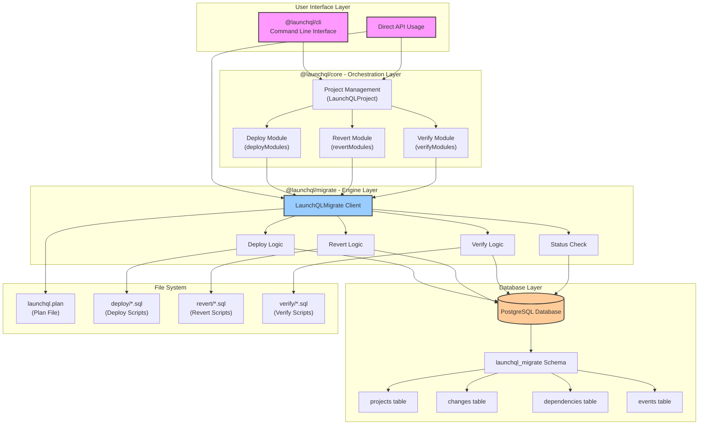
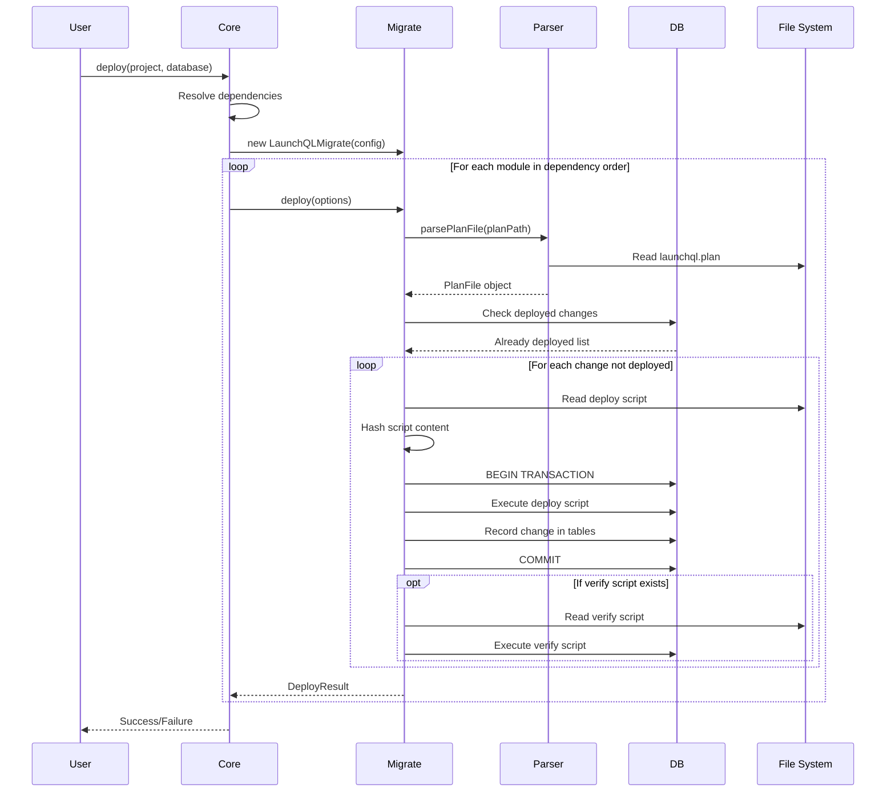

# LaunchQL Migration System Documentation

## Overview

The LaunchQL migration system consists of two main packages that work together to provide a complete database migration solution:

- **@launchql/migrate**: Low-level migration engine (pure TypeScript replacement for Sqitch)
- **@launchql/core**: High-level orchestration and project management

## Architecture



## Data Flow



## API Documentation

### @launchql/migrate - Low-Level Engine

#### LaunchQLMigrate Class

The main client for interacting with the migration system.

```typescript
class LaunchQLMigrate {
  constructor(config: MigrateConfig)
  
  // Initialize migration schema in database
  async initialize(): Promise<void>
  
  // Deploy changes
  async deploy(options: DeployOptions): Promise<DeployResult>
  
  // Revert changes
  async revert(options: RevertOptions): Promise<RevertResult>
  
  // Verify deployment
  async verify(options: VerifyOptions): Promise<VerifyResult>
  
  // Check status
  async status(project: string): Promise<StatusResult>
  
  // Import from existing Sqitch deployment
  async importFromSqitch(): Promise<void>
  
  // Close database connection
  async close(): Promise<void>
}
```

#### Types

```typescript
interface MigrateConfig {
  host?: string;
  port?: number;
  user?: string;
  password?: string;
  database?: string;
}

interface DeployOptions {
  project: string;
  targetDatabase: string;
  planPath: string;
  toChange?: string;        // Deploy up to this change
  useTransaction?: boolean; // Wrap in transaction (default: true)
}

interface RevertOptions {
  project: string;
  targetDatabase: string;
  planPath: string;
  toChange?: string;        // Revert to this change
  useTransaction?: boolean; // Wrap in transaction (default: true)
}

interface VerifyOptions {
  project: string;
  targetDatabase: string;
  planPath: string;
}

interface DeployResult {
  deployed: string[];  // Successfully deployed changes
  skipped: string[];   // Already deployed changes
  failed?: string;     // Failed change name (if any)
}

interface RevertResult {
  reverted: string[];  // Successfully reverted changes
  skipped: string[];   // Not deployed changes
  failed?: string;     // Failed change name (if any)
}

interface VerifyResult {
  verified: string[];  // Successfully verified changes
  failed: string[];    // Failed verifications
}

interface StatusResult {
  project: string;
  totalDeployed: number;
  lastChange: string;
  lastDeployed: Date;
}
```

### @launchql/core - High-Level Orchestration

#### Migration Functions

```typescript
// Deploy modules with dependency resolution
async function deployModules(options: MigrationOptions): Promise<void>

// Revert modules in reverse dependency order
async function revertModules(options: MigrationOptions): Promise<void>

// Verify module deployments
async function verifyModules(options: MigrationOptions): Promise<void>
```

#### Types

```typescript
interface MigrationOptions {
  database: string;      // Target database name
  cwd: string;          // Working directory
  recursive?: boolean;   // Handle multi-module projects
  projectName?: string;  // Required if recursive=true
  useSqitch?: boolean;   // Use sqitch instead of native
  useTransaction?: boolean;
  toChange?: string;     // Deploy/revert to specific change
  
  // Fast deployment options
  fast?: boolean;        // Skip verification
  usePlan?: boolean;     // Use plan-based deployment
  cache?: boolean;       // Cache deployment state
}
```

## Database Schema

The migration system creates a `launchql_migrate` schema with the following tables:

### projects
Tracks migration projects.
```sql
CREATE TABLE launchql_migrate.projects (
    project         TEXT        PRIMARY KEY,
    created_at      TIMESTAMPTZ NOT NULL DEFAULT clock_timestamp()
);
```

### changes
Records deployed changes with their script hashes.
```sql
CREATE TABLE launchql_migrate.changes (
    change_id       TEXT        PRIMARY KEY,
    change_name     TEXT        NOT NULL,
    project         TEXT        NOT NULL REFERENCES projects(project),
    script_hash     TEXT        NOT NULL,
    deployed_at     TIMESTAMPTZ NOT NULL DEFAULT clock_timestamp(),
    UNIQUE(project, change_name),
    UNIQUE(project, script_hash)
);
```

### dependencies
Tracks change dependencies.
```sql
CREATE TABLE launchql_migrate.dependencies (
    change_id       TEXT        NOT NULL REFERENCES changes(change_id),
    requires        TEXT        NOT NULL,
    PRIMARY KEY (change_id, requires)
);
```

### events
Logs deployment events.
```sql
CREATE TABLE launchql_migrate.events (
    event_id        SERIAL      PRIMARY KEY,
    event_type      TEXT        NOT NULL CHECK (event_type IN ('deploy', 'revert', 'fail')),
    change_name     TEXT        NOT NULL,
    project         TEXT        NOT NULL,
    occurred_at     TIMESTAMPTZ NOT NULL DEFAULT clock_timestamp()
);
```

## Usage Examples

### Direct API Usage (Low-Level)

```typescript
import { LaunchQLMigrate } from '@launchql/migrate';

// Create client
const migrate = new LaunchQLMigrate({
  host: 'localhost',
  port: 5432,
  user: 'postgres',
  password: 'password',
  database: 'postgres'
});

// Deploy changes
const result = await migrate.deploy({
  project: 'myproject',
  targetDatabase: 'myapp',
  planPath: './launchql.plan',
  toChange: 'add-users-table'  // Optional: deploy up to specific change
});

console.log(`Deployed: ${result.deployed.join(', ')}`);
console.log(`Skipped: ${result.skipped.join(', ')}`);

// Verify deployment
const verifyResult = await migrate.verify({
  project: 'myproject',
  targetDatabase: 'myapp',
  planPath: './launchql.plan'
});

// Check status
const status = await migrate.status('myproject');
console.log(`Total deployed: ${status.totalDeployed}`);
console.log(`Last change: ${status.lastChange}`);

// Don't forget to close
await migrate.close();
```

### Using Core Orchestration (High-Level)

```typescript
import { deployModules, revertModules } from '@launchql/core';

// Deploy a single module
await deployModules({
  database: 'myapp',
  cwd: '/path/to/module',
  useTransaction: true
});

// Deploy a multi-module project with dependencies
await deployModules({
  database: 'myapp',
  cwd: '/path/to/project',
  recursive: true,
  projectName: 'myproject',
  fast: true  // Skip verification for speed
});

// Revert changes
await revertModules({
  database: 'myapp',
  cwd: '/path/to/module',
  toChange: 'baseline'  // Revert to specific change
});
```

### CLI Usage

```bash
# Deploy a module
launchql deploy --database myapp --project myproject

# Deploy with options
launchql deploy --database myapp --project myproject --fast --no-verify

# Revert to a specific change
launchql revert --database myapp --project myproject --to baseline

# Check status
launchql status --database myapp --project myproject
```

## Key Differences from Sqitch

1. **State Storage**: All migration state is stored in PostgreSQL (`launchql_migrate` schema) instead of a separate registry
2. **No Tags Support**: The current implementation doesn't support Sqitch tags
3. **Simplified Events**: Event logging is minimal compared to Sqitch's detailed event tracking
4. **Script Hashing**: Uses SHA256 for script content verification
5. **Native TypeScript**: No external Perl/Sqitch dependencies required
6. **Transaction Control**: Supports per-change or per-deployment transaction wrapping

## Migration Process

1. **Initialization**: Creates `launchql_migrate` schema if not exists
2. **Plan Parsing**: Reads `launchql.plan` file to get changes and dependencies
3. **Dependency Resolution**: Orders changes based on dependencies
4. **Deployment**:
   - Check if change already deployed (by name and hash)
   - Read deploy script from filesystem
   - Execute script in transaction
   - Record change in database
   - Run verify script if exists
5. **Verification**: Run verify scripts for all deployed changes
6. **Revert**: Execute revert scripts in reverse order

## Error Handling

- Failed deployments are rolled back (if using transactions)
- Events are logged for all operations (deploy, revert, fail)
- Script hash verification prevents deploying modified scripts
- Dependency violations are caught before deployment

## Best Practices

1. **Always use transactions** for production deployments
2. **Write idempotent scripts** that can be run multiple times safely
3. **Include verify scripts** to ensure deployments are successful
4. **Use meaningful change names** that describe what they do
5. **Test migrations** in development before production
6. **Keep revert scripts** up to date with deploy scripts
7. **Use dependency management** to ensure correct deployment order