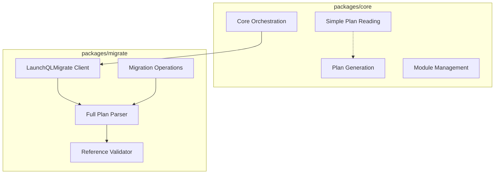
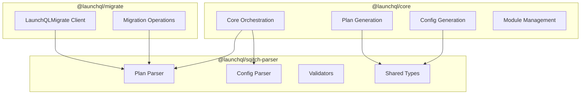

# Plan File Parsing Analysis: Core vs Migrate

## Current State

### packages/migrate
- **Location**: `src/parser/plan-parser.ts`, `src/parser/validators.ts`, `src/parser/plan.ts`
- **Functionality**: Full-featured plan file parser with validation
- **Features**:
  - Parses all Sqitch reference formats (tags, SHA1, relative refs, symbolic refs)
  - Validates change names and tag names according to Sqitch spec
  - Resolves references to actual changes
  - Returns detailed error information with line numbers
  - Used by `LaunchQLMigrate` client for all migration operations

### packages/core
- **Location**: `src/modules.ts`, `src/class/launchql.ts`, `src/resolve.ts`
- **Functionality**: Multiple plan file operations with varying complexity
- **Features**:
  - Simple line-based reading to get latest change (`latestChange()` function)
  - Plan file generation (`generateModulePlan()`, `writeModulePlan()`)
  - **Plan parsing in `resolveWithPlan()`** - extracts all changes from plan file
  - No validation or reference parsing
  - Delegates actual migration operations to `@launchql/migrate`

## Code Examples

### Migrate's Comprehensive Parsing
```typescript
// packages/migrate/src/parser/plan-parser.ts
const result = parsePlanFileWithValidation('/path/to/sqitch.plan');
// Returns: {
//   plan: { project, uri, changes, tags },
//   errors: [{ line, message }]
// }
```

### Core's Multiple Parsing Approaches
```typescript
// packages/core/src/modules.ts - Simple last change extraction
const plan = readFileSync(`${basePath}/${module.path}/sqitch.plan`, 'utf-8')
  .split('\n')
  .map((line) => line.trim())
  .filter(Boolean);
return plan[plan.length - 1].split(' ')[0]; // Just gets last change name

// packages/core/src/resolve.ts - Full change list extraction
let resolved = plan
  .split('\n')
  .filter(
    (line) =>
      line.trim().length > 0 && // Exclude empty lines
      !line.trim().startsWith('%') && // Exclude initial project settings
      !line.trim().startsWith('@') // Exclude tags
  )
  .map((line) => line.split(' ')[0]);
```

## Architecture Diagram



## Should We Consolidate?

### Issues with Current Approach:

1. **Code Duplication**: Both packages parse plan files independently
   - Core has at least 3 different parsing implementations
   - Migrate has comprehensive parsing with validation
   - Similar logic for filtering lines, extracting change names

2. **Inconsistency**: Different parsing logic could lead to different results
   - Core's simple parsing might miss edge cases
   - No validation in core could allow invalid plans

3. **Maintenance Burden**: Bug fixes and improvements need to be made in multiple places

### Benefits of a Shared Package:

1. **Single Source of Truth**: One implementation of plan parsing logic
2. **Consistent Behavior**: All packages parse plans the same way
3. **Better Testing**: Centralized tests for all parsing scenarios
4. **Gradual Enhancement**: Can start simple and add features as needed

### Recommendation: Create @launchql/sqitch-parser

After reviewing `resolve.ts` and considering other Sqitch files, I recommend creating a more generic shared package because:
- Clear code duplication exists (multiple plan parsing implementations)
- Both packages need to extract changes from plan files
- Future need to parse sqitch.conf and other Sqitch-related files
- A shared parser would ensure consistency across all Sqitch file handling

## Proposed Architecture with @launchql/sqitch-parser



### Proposed API for @launchql/sqitch-parser

```typescript
// Plan file parsing
export function parsePlanFile(planPath: string): ParseResult;
export function getChanges(planPath: string): string[];
export function getLatestChange(planPath: string): string;
export function validatePlan(plan: PlanFile): ValidationError[];
export function resolveReference(ref: string, plan: PlanFile): ResolvedReference;

// Config file parsing (future)
export function parseConfigFile(configPath: string): ConfigResult;
export function getConfigValue(config: ConfigFile, section: string, key: string): string;

// Shared types
export interface PlanFile { ... }
export interface ConfigFile { ... }
export interface Change { ... }
export interface Tag { ... }
```

## Migration Strategy

1. **Phase 1**: Extract current plan parser from migrate to @launchql/sqitch-parser
2. **Phase 2**: Update migrate to use the new package
3. **Phase 3**: Update core to use the new package instead of custom parsing
4. **Phase 4**: Add config file parsing support when needed
5. **Phase 5**: Add support for other Sqitch files as requirements emerge

## Benefits of Generic Naming

- **Future-proof**: Can add parsers for sqitch.conf, META.json, etc.
- **Cohesive**: All Sqitch-related parsing in one place
- **Discoverable**: Clear package purpose from the name
- **Extensible**: Room to grow without renaming

## Summary

- **Recommendation**: Create @launchql/sqitch-parser (not just plan-parser)
- **Code duplication exists**: Multiple implementations of plan parsing across packages
- **Future needs**: Will likely need to parse sqitch.conf and other Sqitch files
- **Shared package benefits**: Consistency, maintainability, single source of truth
- **Clean architecture**: No circular dependencies, clear separation of concerns